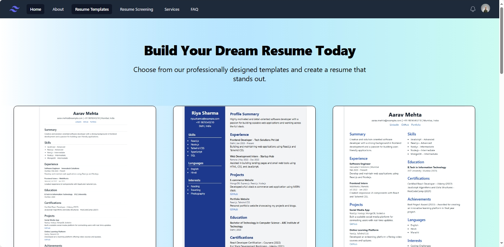

# ResumeApp
This ResumeApp is an AI powered Resume Builder and Screening Assistant app and helps users create professional, customizable resumes effortlessly. It provides real-time feedback, analyzes strengths, and suggests improvements based on industry standards. With smart screening and job.

## Project Snapshots

###  Home Page

###  Role Selection Page

###  Login Page

###  Signup Page

###  User Resume Templates Page

###  Resume Builder Page

###  Resume Builder Page(Part 2)

###  User Resume Preview Page

###  User Resume Preview Page(Part 2)

###  Resume Screening Page

###  Resume Result Page

###  Admin Dashboard Page

###  Admin Dashboard Page(Part 2)

##  Tech Stack
- React
- Tailwind CSS
- Spring Boot
- Flask API
- NLP
- MySQL

 
